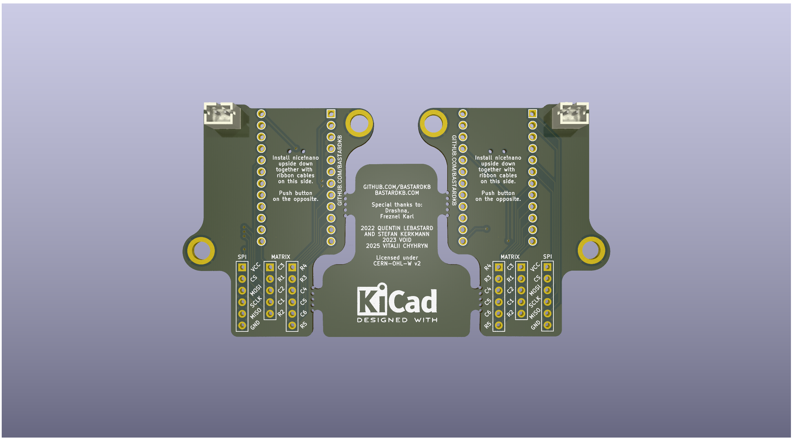
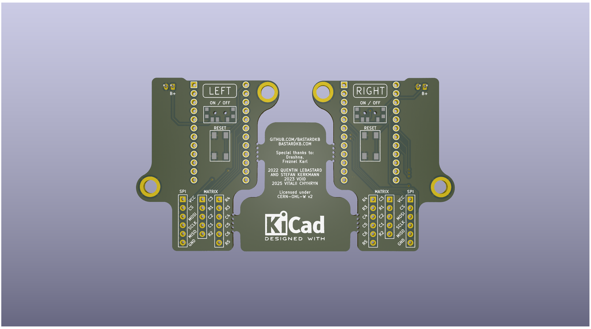

# Holder PCB for nice!nano
Holder PCB for BastardKB TBK mini

## WARNING
The PCBs have not been validated yet, they are not confirmed to be working!

## Features:
- Matrix pinout moved to low frequency pins
- SPI trackball connection moved to high frequency pins
- Removed RGB and serial connection
- Repositioned power switch and reset button
- PH 2.0 battery connector

## License 
This work is licensed under a Creative Commons Attribution-NonCommercial-ShareAlike 4.0 International License.
