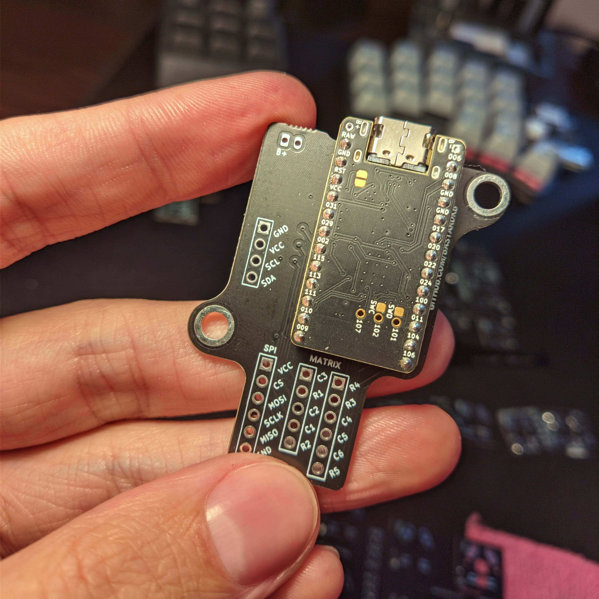

## Holder PCB for nice!nano

### nice!nano v2 holder PCB for Bastard Keyboards Charybdis
### WARNING: The PCBs have been validated, they are confirmed to be working, but small changes have been made since the original batch was ordered; there might be discrepancies between the schematic and PCB, use at your own risk and go over the files before ordering any prototypes.

### Features:
- matrix pinout moved to low frequency pins
- spi trackball connection moved to high frequency pins
- removed rgb and serial connection
- repositioned reset footprint
- ph2 battery connector

## Forks

[Holiot carrier](https://github.com/vattern/holiot-carrier) for bluetooth

[Splinktegrated](https://github.com/Bastardkb/Splinktegrated/tree/features/holder2) - Integrated rp2040 and usb-c daughterboard (work in progress)

[Blackpill holder](https://github.com/Bastardkb/adapter-blackpill/)

# License 

This work is licensed under a Creative Commons Attribution-NonCommercial-ShareAlike 4.0 International License.
